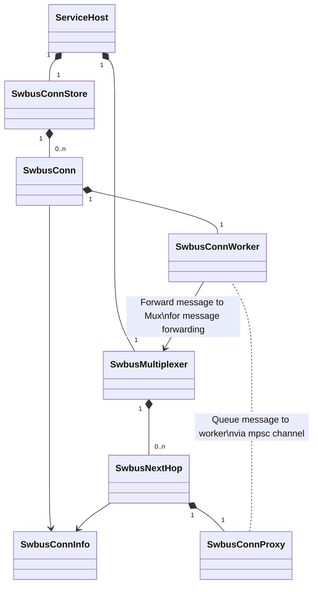

# SONiC - SWitch BUS (SWBus) Core

## Overview

SWBus is a high-performance and scalable message channel for SONiC internal services. It is designed to provide an easy-to-use interface for the intra/inter-switch communication for the internal services.

SWBus is built on top of the [gRPC](https://grpc.io/) framework and uses [Protocol Buffers](https://developers.google.com/protocol-buffers) for message serialization.

## Architecture

On high level, the architecture of the switch bus core is shown as below.



### Message forwarding flow

```mermaid
sequenceDiagram
```

## Getting Started

To get started, please refer to the [DASH HA (High Availability) README](../README.md).

